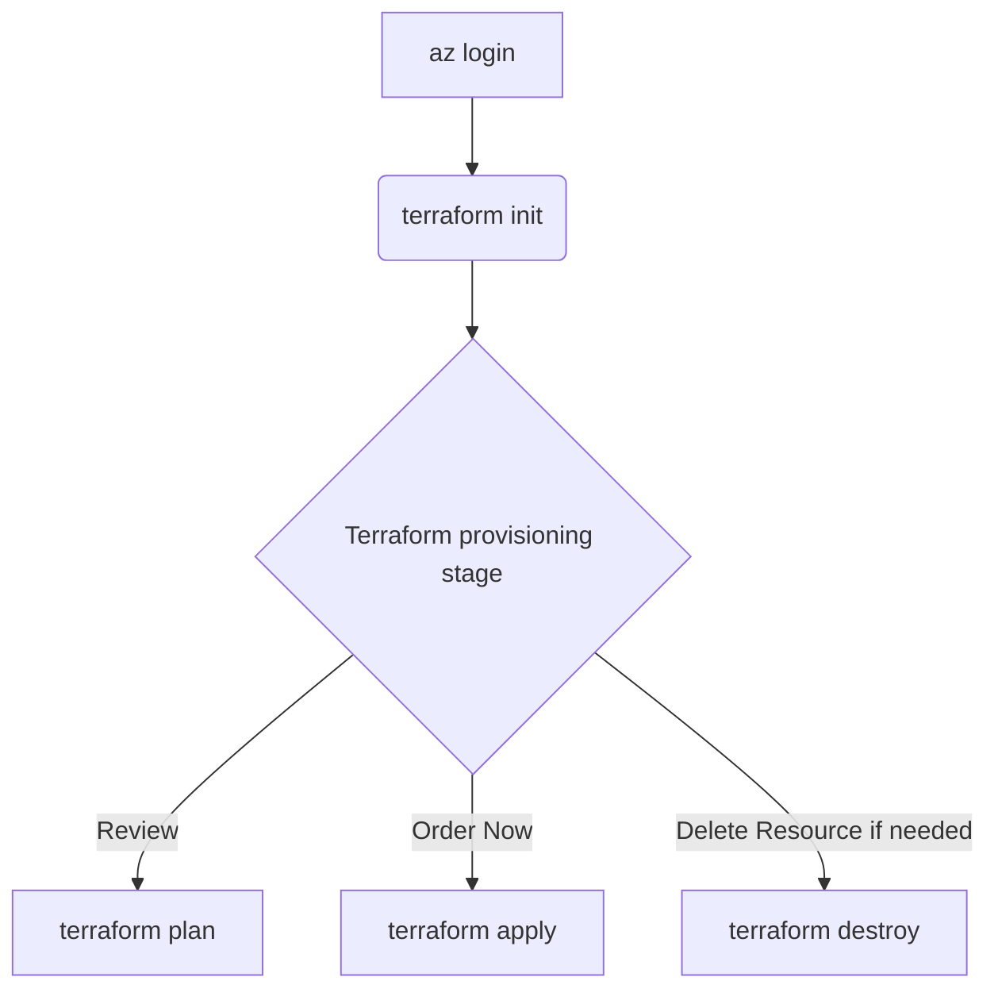

# Azure Infrastructure Terraform Templates

> This approach focuses on `setting up the required infrastructure via Terraform`. It allows for source control of not only the solution code, connections, and setups `but also the infrastructure itself`.

<details markdown="1">
<summary><strong>Table of contents</strong></summary>

- [Prerequisites](#prerequisites)
- [Overview](#overview)
- [How to execute it](#how-to-execute-it)

</details>

> E.g With Container App deployment:

<div align="center">
  
</div>

<div align="center">
  
</div>

## Prerequisites

- An `Azure subscription is required`. All other resources, including instructions for creating a Resource Group, are provided in this workshop.
- `Contributor role assigned or any custom role that allows`: access to manage all resources, and the ability to deploy resources within subscription.
- Please ensure that:
  - [Terraform is installed on your local machine](https://developer.hashicorp.com/terraform/tutorials/azure-get-started/install-cli#install-terraform).
  - [Install the Azure CLI](https://learn.microsoft.com/en-us/cli/azure/install-azure-cli) to work with both Terraform and Azure commands.

## Overview

Templates structure:

```
.
├── README.md
├────── main.tf
├────── variables.tf
├────── provider.tf
├────── terraform.tfvars
├────── outputs.tf
```

- main.tf `(Main Terraform configuration file)`: This file contains the core infrastructure code. It defines the resources you want to create, such as virtual machines, networks, and storage. It's the primary file where you describe your infrastructure in a declarative manner.
- variables.tf `(Variable definitions)`: This file is used to define variables that can be used throughout your Terraform configuration. By using variables, you can make your configuration more flexible and reusable. For example, you can define variables for resource names, sizes, and other parameters that might change between environments.
- provider.tf `(Provider configurations)`: Providers are plugins that Terraform uses to interact with cloud providers, SaaS providers, and other APIs. This file specifies which providers (e.g., AWS, Azure, Google Cloud) you are using and any necessary configuration for them, such as authentication details.
- terraform.tfvars `(Variable values)`: This file contains the actual values for the variables defined in `variables.tf`. By separating variable definitions and values, you can easily switch between different sets of values for different environments (e.g., development, staging, production) without changing the main configuration files.
- outputs.tf `(Output values)`: This file defines the output values that Terraform should return after applying the configuration. Outputs are useful for displaying information about the resources created, such as IP addresses, resource IDs, and other important details. They can also be used as inputs for other Terraform configurations or scripts.

## How to execute it



!!! important
    Please modify `terraform.tfvars` with your information, then run the following flow. If you need more visual guidance, please check the video that illustrates the provisioning steps.

1. **Login to Azure**: This command logs you into your Azure account. It opens a browser window where you can enter your Azure credentials. Once logged in, you can manage your Azure resources from the command line.

    > Go to the path where Terraform files are located:

    ```sh
    cd terraform-infrastructure
    ```

    ```sh
    az login
    ```

    

    

2. **Initialize Terraform**: Initializes the working directory containing the Terraform configuration files. It downloads the necessary provider plugins and sets up the backend for storing the state.

    ``` sh
    terraform init
    ```

   

### 3. Terraform provisioning stage

#### Review

Create an execution plan to review the actions Terraform will take using the values in `terraform.tfvars`.

```sh
terraform plan -var-file terraform.tfvars
```

When the command completes successfully, Terraform displays a green confirmation message.


#### Provision infrastructure

Apply the required changes. Terraform prompts for confirmation before making changes.

```sh
terraform apply -var-file terraform.tfvars
```


#### Remove infrastructure

Destroy the infrastructure managed by Terraform when it is no longer required.

```sh
terraform destroy -var-file terraform.tfvars
```


